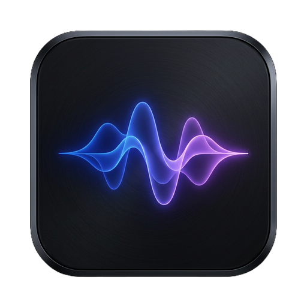
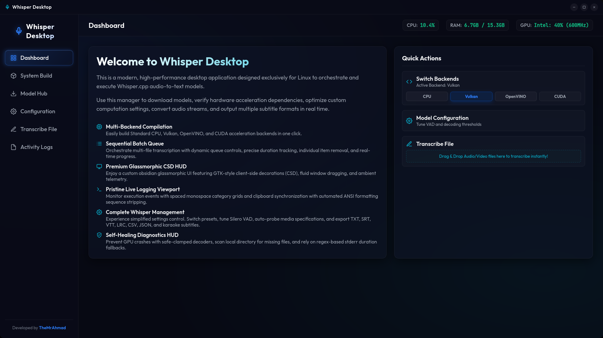
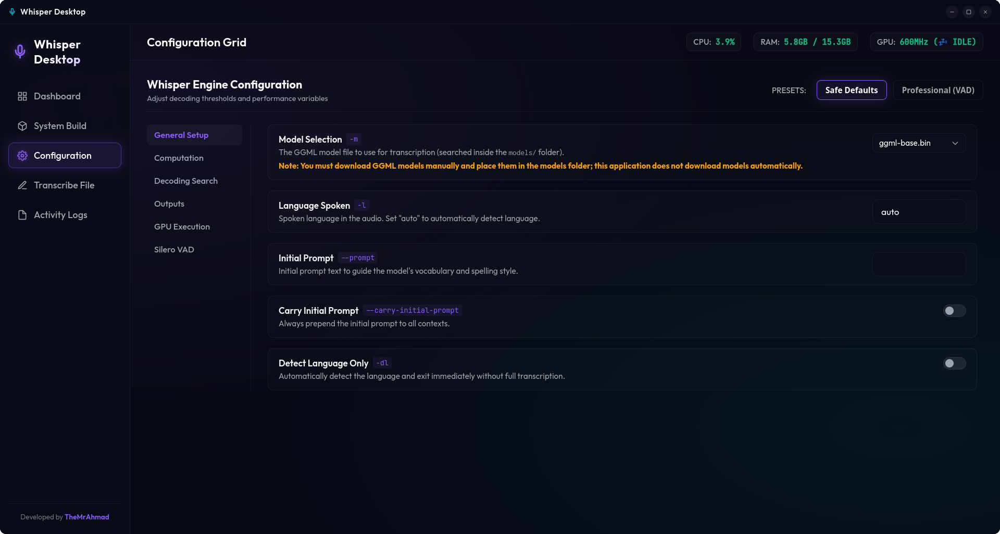
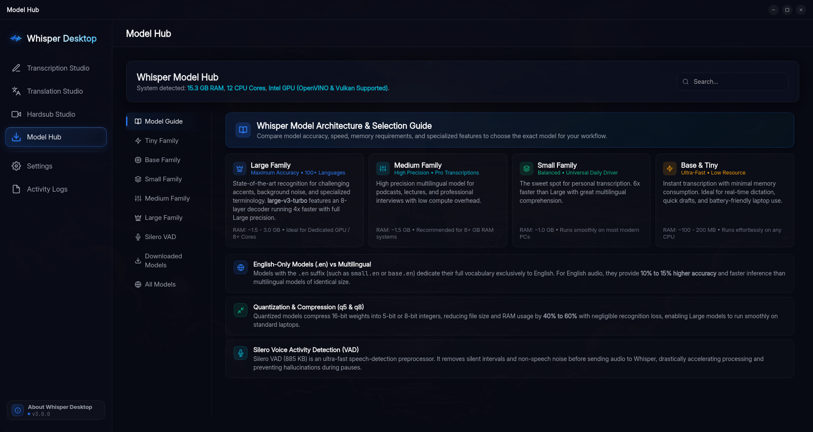
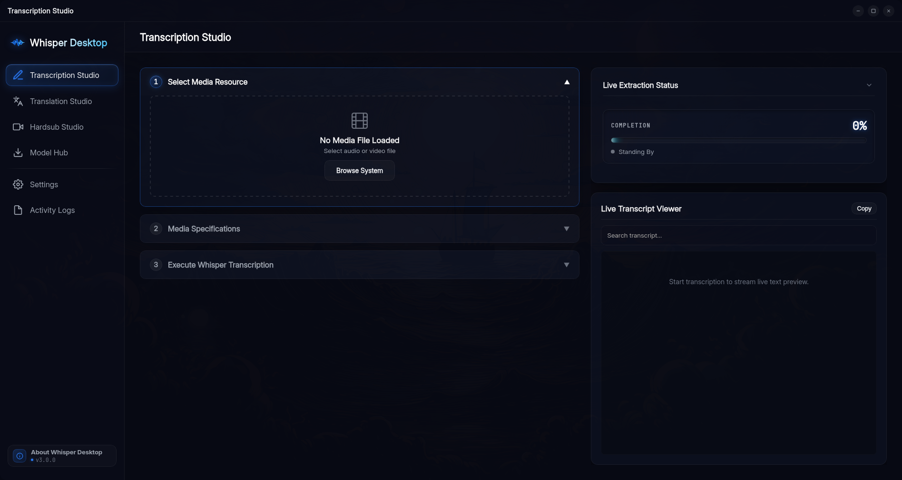
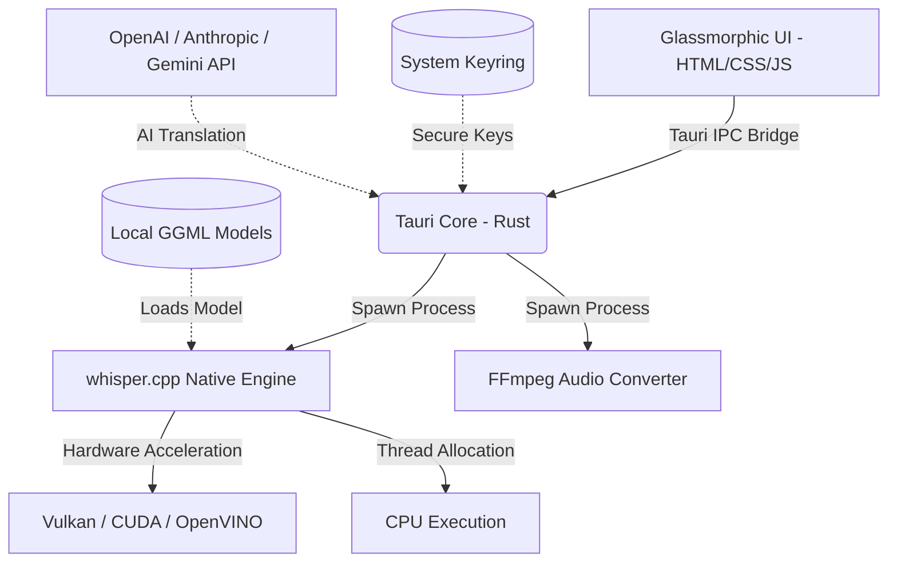

<p align="center">
  
</p>

<h1 align="center">Whisper Desktop</h1>

<p align="center">
  <strong>A premium, high-performance native desktop GUI for local speech-to-text powered by Whisper.cpp and Rust.</strong>
</p>

<p align="center">
  <a href="LICENSE"></a>
  
  
  
</p>

---

## 💡 What is Whisper Desktop?

**Whisper Desktop** is a modern, lightweight, and privacy-focused desktop application designed to bring the incredible power of OpenAI's **Whisper** speech recognition model directly to your personal computer.

Running AI models locally often requires navigating command-line interfaces, installing complex Python environments, or exposing sensitive audio files to paid cloud services. **Whisper Desktop** eliminates all of that by pairing a blazing-fast **Rust & Tauri** backend with native `whisper.cpp` binaries and a gorgeous glassmorphic GUI.

### 🎯 Core Goals & Key Highlights

* **🔒 100% Local & Private:** Speech recognition and audio conversion run entirely on your local machine. No data is sent to external servers.
* **⚡ Multi-Backend Acceleration:** Switch seamlessly between **CPU**, **Vulkan**, **CUDA**, or **OpenVINO** directly from the interface for near-instant transcription.
* **🎞️ Direct Smart Media Import:** Drop any video or audio file directly into the app—no manual audio conversion or pre-extraction required.
* **🎛️ Complete Engine Orchestration:** Fine-tune decoding parameters, Silero VAD silence filtering, beam sizes, and thread concurrency.
* **🤖 Multi-Provider AI Translation:** Post-process and translate subtitles into 120+ languages using OpenAI, Anthropic, Gemini, or local LLMs (LM Studio/Ollama) with secure system keyring storage.
* **✨ Glassmorphic UI & Real-Time Telemetry:** Dark-mode interface featuring dynamic hardware metrics (CPU/RAM/GPU), drag-and-drop file queue, and live transcript highlighting.

---

## 📸 Screenshots & Visual Walkthrough

<div align="center">
  
  
  <br/><br/>
  
  
</div>

---

## ✨ Features Breakdown

### 🎙️ Speech-to-Text Engine & Audio Pipeline
* **⚡ Multi-Acceleration Backends:** Choose between **CPU**, **Vulkan**, **OpenVINO**, or **CUDA** directly from the UI. Precompiled binaries are bundled so no local SDK setup is required.
* **🎞️ Direct Smart Media Processing:** Drop any video or audio format (MP4, MKV, AVI, MOV, FLV, WEBM, MP3, WAV, FLAC, M4A, etc.) directly into the app—zero manual pre-conversion or audio extraction needed. The built-in FFmpeg pipeline transparently converts media into an optimized 16kHz mono WAV stream on the fly. Smart path redirection automatically routes outputs to `~/Documents/WhisperOutputs/` when working outside your home folder.
* **📥 Integrated Model Downloader:** Browse, download, pause, resume, and manage GGML models (Tiny, Base, Small, Medium, Large, Q4/Q5/Q8) with live speed, progress, and ETA tracking.
* **📂 Batch Processing Queue:** Import multiple audio/video files via **Drag & Drop**, reorder queue items, inspect metadata/duration, and transcribe sequentially.
* **⚙️ Complete Decoding Controls:** Adjust threads, processors, temperature, beam size, best-of, initial prompts, carry-over prompts, diarization, and word-level timestamps (DTW).
* **📄 Flexible Export Formats:** Export transcripts as **SRT, VTT, LRC, TXT, CSV, JSON**, and full word-level timestamp files.
* **★ Hardware-Guided Recommendations:** Recommends optimal model sizes and quantization formats based on detected RAM, CPU cores, and GPU type.

### 🎛️ Advanced Engine Orchestration & VAD Tuning
* **Complete Parameter Control:** Granular control over VAD thresholds, minimum speech/silence duration, beam search size, temperature fallbacks, diarization, and word-level DTW timestamps.
* **Granular Controls:** Configurable VAD threshold, minimum speech duration, minimum silence duration, speech padding, and segment overlap.

### 🤖 AI Subtitle Translation Pipeline
* **Multi-Provider API Manager:** Add and manage API configurations for **OpenAI**, **Anthropic (Claude)**, **Google Gemini**, or **OpenAI-Compatible** endpoints (e.g., LM Studio, Ollama).
* **🔐 Secure System Keyring:** Stores API keys safely in your native OS keychain (`secret-service` / `kwallet` / `keyring`) instead of plain text files.
* **Formatting Preservation:** Uses token-aware chunking with overlap to keep SRT/VTT/LRC subtitle timestamps and index numbers perfectly aligned during translation.
* **Model & Reasoning Control:** Supports model selection, reasoning intensity levels (None/Low/Medium/High), custom translation prompts, and live line-by-line preview.
* **Auto-Recovery:** Automatic token-limit error handling dynamically reduces chunk size and retries without failing the entire file.

### 📊 User Experience, Telemetry & Logs
* **📝 Live Transcript Viewer:** Real-time line streaming with active word highlighting, search/filter capabilities, and inline editing.
* **📊 Live Telemetry HUD:** Real-time monitoring of CPU usage, RAM utilization, and active GPU metrics during transcription.
* **🗂️ Unified Activity Logs:** Centralized log panel with category filtering (FFmpeg, Whisper, AI Translation, Build, System) and export options.
* **🔔 Native OS Notifications:** Receive system desktop notifications (`notify-send`) when background transcription jobs complete or fail.

---

## 🛠️ System Architecture



---

## 🚀 Installation & Packaging

### 📦 Arch Linux (AUR)
```bash
paru -S whisper-desktop-bin
```

### 🐧 Debian / Ubuntu (`.deb`)
```bash
sudo dpkg -i Whisper.Desktop_*_amd64.deb
sudo apt-get install -f
```

### 🎩 RedHat / Fedora (`.rpm`)
```bash
sudo dnf install Whisper.Desktop-*.rpm
```

### 🐳 AppImage
```bash
chmod +x Whisper.Desktop_*.AppImage
./Whisper.Desktop_*.AppImage
```

---

## 💻 Building from Source

### Prerequisites
* **Node.js** (v18+) & **npm**
* **Rust** toolchain (latest stable)
* **System Libraries:** `gtk3`, `webkit2gtk-4.1`, `ffmpeg`

### 1. Clone Repository
```bash
git clone https://github.com/AtomicError/whisper-desktop.git
cd whisper-desktop
```

### 2. Install Dependencies
```bash
npm install
```

### 3. Run Development Mode
```bash
npm run tauri dev
```

### 4. Build Production Bundle
```bash
npm run tauri build
```
Production packages will be generated in `src-tauri/target/release/bundle/`.

---

## 📦 Project Structure

```
whisper-desktop/
├── src/                          # Frontend (Vanilla JS & Modern Glassmorphic CSS)
│   ├── index.html                # Main UI layout & view panels
│   ├── styles.css                # Glassmorphic design system
│   └── main.js                   # State management & IPC bridge logic
├── src-tauri/                    # Tauri / Rust Backend
│   ├── src/
│   │   ├── main.rs               # Entry point & Tauri command handlers
│   │   ├── settings.rs           # Profile & setting management
│   │   ├── transcribe.rs         # FFmpeg & whisper-cli process orchestration
│   │   ├── downloader.rs         # Model downloading with resume support
│   │   ├── hardware.rs           # System stats & hardware polling
│   │   ├── logger.rs             # Application logging ring-buffer
│   │   └── translation/          # AI Translation pipeline
│   ├── resources/                # Precompiled binaries (whisper-cli)
│   └── tauri.conf.json           # Tauri app configuration
└── README.md
```

---

## 🔒 Privacy Guarantee

All speech transcription, audio conversion, and model execution run **100% locally** on your computer. Your audio files and transcripts never leave your machine unless you explicitly enable the optional AI Translation feature to communicate with your chosen API provider.

---

## 💖 Support the Project

If you find **Whisper Desktop** helpful and want to support its ongoing development, maintenance, and new features, donations are greatly appreciated:

* **TRON (TRX / TRC20):**
  ```text
  TDXH4vErrWunXfd6nHJX5mTNr4uHuPD1im
  ```

---

## 📬 Contact & Community

Have a question, feedback, or want to collaborate? Feel free to reach out:

* **Telegram:** [@TheMrAhmad](https://t.me/TheMrAhmad)

---

## 📄 License
This project is licensed under the [MIT License](LICENSE).

