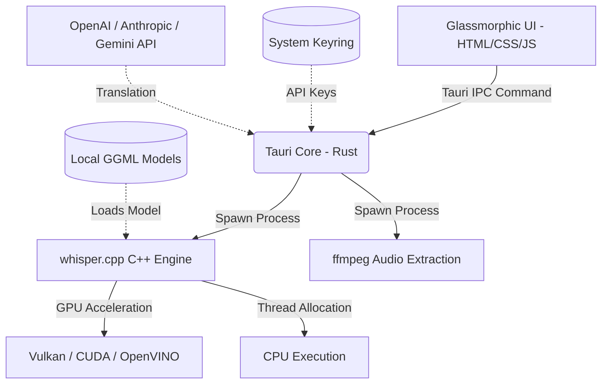

<p align="center">
  
</p>

<h1 align="center">Whisper Desktop</h1>

<p align="center">
  <strong>A premium, state-of-the-art, and gorgeous native Rust & Tauri GUI designed for whisper.cpp.</strong><br>
  Run high-performance local speech-to-text models with ease, beauty, and complete privacy.
</p>

<p align="center">
  <a href="LICENSE"></a>
  
  
</p>

---

## 📸 Screenshots & Visual Walkthrough

| 🎛️ Dashboard Home | 🛠️ Configuration Step |
| :---: | :---: |
|  |  |

| 📥 Model Hub | 🎙️ Transcription Screen |
| :---: | :---: |
|  |  |

---

## ✨ Features at a Glance

*   **⚡ Multiple Acceleration Backends:** Choose between **CPU**, **Vulkan**, **OpenVINO**, or **CUDA** directly from the UI. *Note: Precompiled binaries for all backends are bundled directly inside the app, so no local compilation or system-level developer SDKs are required.*
*   **📥 Integrated Model Downloader:** Browse and download GGML models from the UI with real-time speed, progress bars, and ETA tracking. Supports pause, resume, and delete.
*   **📂 Batch Processing Queue:** Import multiple files, view duration, remove items, and transcribe them sequentially with detailed per-file progress.
*   **🎞️ Integrated Media Converter:** Auto-extract 16kHz mono WAV from any audio/video file via FFmpeg. Output is placed next to the source file or redirected to `~/Documents/WhisperOutputs/` if the source is outside your home directory.
*   **🤖 AI Translation — Provider Manager:** Add, edit, and remove AI providers supporting OpenAI-compatible, Anthropic, and Gemini API formats. API keys can be stored securely in the system keyring rather than plaintext config files. Each provider's model list is fetched automatically and filtered by the selected API format.
*   **🤖 AI Translation — Model Configuration:** Per-provider model management with reasoning levels (None/Low/Medium/High), active model selection via radio buttons, and context window auto-detection. The system automatically recovers from token-limit errors by reducing chunk sizes.
*   **🤖 AI Translation — Pipeline:** Preserves original subtitle formatting (SRT, VTT, LRC, TXT) through token-aware text chunking with configurable overlap. Preview translation of selected lines before committing. Full cancel support via session state machine with immediate HTTP request abort.
*   **🗣️ Voice Activity Detection (VAD):** Built-in Silero VAD model support — automatically detects speech segments and reduces processing time on silent sections. Configurable threshold, speech tolerance, and min segment duration.
*   **🎨 Premium Glassmorphic Design:** Dark-mode interface with micro-animations, royal-blue gradient accents, and fluid layout transitions. Custom-styled dropdowns, toggles, radio buttons, and scrollbars throughout.
*   **📦 Drag & Drop:** Drag audio/video files onto the dashboard to instantly load them into the queue.
*   **📊 Live Telemetry HUD:** Real-time CPU usage, RAM utilization, and GPU metrics displayed during transcription.
*   **⚙️ Full Transcription Settings:** Adjust threads, language, output formats (TXT, SRT, VTT, LRC, CSV, JSON), temperature, beam size, best-of, word-level timestamps (DTW), VAD parameters, and more.
*   **★ Spec-Guided Recommendations:** Recommends optimal model sizes and quantization formats based on detected hardware and GPU type.
*   **📝 Live Transcript Viewer:** Editable transcript lines with inline search/filter. Logged timestamps and real-time word highlighting.
*   **🗂️ Activity Logs:** Central logging panel with per-category filtering (FFmpeg, Whisper, Build, System). Real-time log streaming and full history.

---

## 🛠️ Interactive Architecture

Whisper Desktop orchestrates native `whisper.cpp` binaries using Tauri's Rust IPC bridge.



---

## 🚀 Installation & Packaging

### 📦 Arch Linux (AUR)
```bash
paru -S whisper-desktop-bin
```

### 🐧 Debian / Ubuntu (`.deb`)
```bash
sudo dpkg -i Whisper.Desktop_*_amd64.deb
sudo apt-get install -f
```

### 🎩 RedHat / Fedora (`.rpm`)
```bash
sudo dnf install Whisper.Desktop-*.rpm
```

### 🐳 AppImage
```bash
chmod +x Whisper.Desktop_*.AppImage
./Whisper.Desktop_*.AppImage
```

---

## 💻 Development & Building from Source

Prerequisites:
*   **Node.js** (v18+) & **npm**
*   **Rust** toolchain (latest stable)
*   **System Libraries:** `gtk3`, `webkit2gtk-4.1`, `ffmpeg`
*   **Optional:** `wl-copy`, `xclip`, or `xsel` for clipboard support
*   **Precompiled Binaries:** Since the app packages precompiled whisper.cpp binaries at runtime, you need to place a compiled `whisper-cli` binary (renamed to `whisper-cli-standard`, `whisper-cli-vulkan`, etc.) inside the `src-tauri/resources/` folder before running or building.

### 1. Clone the Repository
```bash
git clone https://github.com/AtomicError/whisper-desktop.git
cd whisper-desktop
```

### 2. Install Frontend Dependencies
```bash
npm install
```

### 3. Run in Development Mode
```bash
npm run tauri dev
```

### 4. Build Production Packages
```bash
npm run tauri build
```
Production packages are generated in `src-tauri/target/release/bundle/`.

---

## 📦 Project Structure

```
whisper-desktop/
├── src/                          # Frontend (vanilla JS/CSS)
│   ├── index.html                # Main layout (6 view panels)
│   ├── styles.css                # Glassmorphic design system (~3870 lines)
│   └── main.js                   # IPC, state, and all UI logic (~4130 lines)
├── src-tauri/                    # Tauri / Rust backend
│   ├── src/
│   │   ├── main.rs               # Tauri command bindings, managed state
│   │   ├── lib.rs                # Entry point, plugin registration
│   │   ├── settings.rs           # WhisperSettings + AppSettings (JSON load/save)
│   │   ├── transcribe.rs         # ffmpeg conversion, whisper-cli orchestration
│   │   ├── builder.rs            # git clone/pull, cmake build coordination
│   │   ├── downloader.rs         # curl model download with resume
│   │   ├── hardware.rs           # CPU/RAM/GPU polling
│   │   ├── logger.rs             # Ring-buffer log + real-time IPC emit
│   │   └── translation/          # AI translation module
│   │       ├── mod.rs            # Public API (translate, preview, model fetch)
│   │       ├── translator.rs     # Core translation loop with chunking + retry
│   │       ├── provider.rs       # API request formatting + keyring storage
│   │       ├── formatter.rs      # SRT/VTT/LRC/TXT parse + reconstruct
│   │       ├── chunker.rs        # Token-aware text chunking
│   │       └── prompts.rs        # Translation system prompts
│   ├── permissions/
│   │   └── allow-all-custom.toml # Command allow-list for Tauri v2
│   ├── capabilities/
│   │   └── default.json          # Window capability bindings
│   ├── icons/                    # App icons (all required formats)
│   └── tauri.conf.json           # Tauri configuration
├── .github/workflows/
│   └── release.yml               # CI/CD build pipeline
└── README.md
```

---

## 🔒 Privacy & Local Processing

All audio transcription and processing run **100% locally** on your computer. The optional AI Translation feature sends text to your chosen API provider (OpenAI, Anthropic, Gemini, or any OpenAI-compatible endpoint) — API keys can be stored in your system keyring rather than in plaintext config files.

---

## 📄 License
This project is licensed under the [MIT License](LICENSE).
