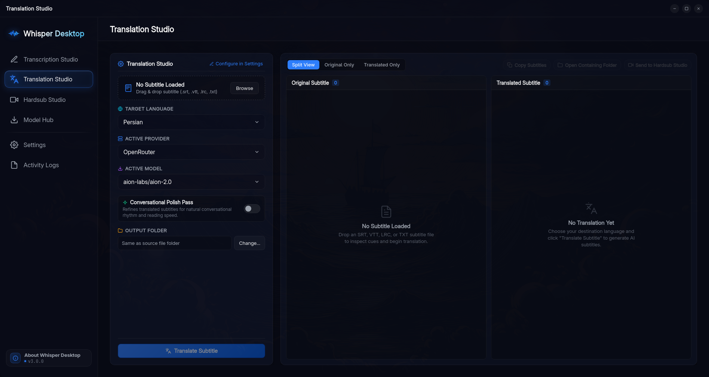
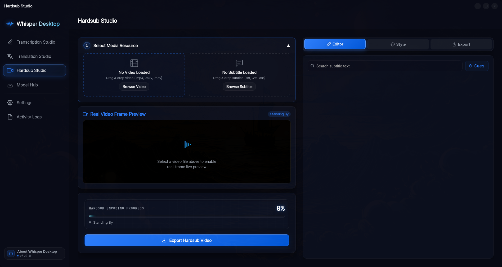
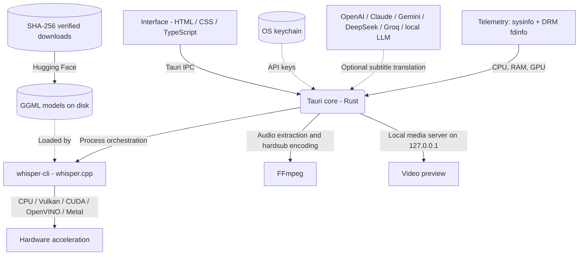

<p align="center">
  
</p>

<h1 align="center">Whisper Desktop</h1>

<p align="center">
  <strong>Turn audio and video into text and subtitles on your own computer — transcribe, translate, and burn subtitles into video, without a command line, a Python environment, or a cloud account.</strong>
</p>

<p align="center">
  <a href="LICENSE"></a>
  
  
  
  
</p>

---

## Index

- [What it is](#what-it-is)
- [What you can do with it](#what-you-can-do-with-it)
- [Screenshots](#screenshots)
- [Requirements](#requirements)
  - [Execution backends](#execution-backends)
  - [Model memory guide](#model-memory-guide)
- [Quick start](#quick-start)
- [Installing](#installing)
  - [Linux](#linux)
  - [Arch Linux (AUR)](#arch-linux-aur)
  - [Windows](#windows)
  - [macOS](#macos)
- [The four workspaces](#the-four-workspaces)
  - [Transcription Studio](#transcription-studio)
  - [Batch transcription](#batch-transcription)
  - [Translation Studio](#translation-studio)
  - [Hardsub Studio](#hardsub-studio)
  - [Model Hub](#model-hub)
- [Configuring Whisper](#configuring-whisper)
- [Themes, interface languages and shortcuts](#themes-interface-languages-and-shortcuts)
- [Files, folders and where your data lives](#files-folders-and-where-your-data-lives)
- [Privacy](#privacy)
- [Troubleshooting](#troubleshooting)
- [Architecture](#architecture)
- [Project layout](#project-layout)
- [Credits](#credits)
- [License](#license)
- [Support and contact](#support-and-contact)

---

## What it is

Whisper Desktop is a native desktop application for **speech recognition and subtitle work that runs entirely on your machine**.

Whisper Desktop integrates two proven engines directly, so you get their speed and quality without their command lines:

* **whisper.cpp** (the C/C++ port of OpenAI's Whisper) does the speech recognition — the same engine the `whisper-cli` command uses.
* **FFmpeg** handles media: decoding any audio or video file into the 16 kHz mono audio that Whisper needs, and encoding video again when you burn subtitles into it.

Everything above those two engines is Whisper Desktop's own work: the single-file and batch transcription workflows, the model manager, the subtitle translation engine with its provider system, the subtitle styling and frame-accurate burn-in pipeline, the hardware telemetry, and the entire interface.

The application itself is a **Rust + Tauri v2** desktop application with a web-technology interface. There is no Python environment to create, no model server to start, and no cloud account to sign in to. You pick a file, pick a model, and press a button; the app assembles the FFmpeg and `whisper-cli` invocations that you would otherwise have to write by hand.

**It is three tools in one window:**

1. **Transcription** — audio/video → text and subtitle files (SRT, VTT, TXT, JSON, ASS, LRC, CSV).
2. **Translation** — an existing subtitle file → the same subtitle in another language, via an AI provider you choose (or a local LLM).
3. **Hardsub** — a video plus a subtitle file → a new video with the subtitles permanently burned in, styled and rendered by GPU-accelerated FFmpeg.

Around those sits a **Model Hub** that downloads and verifies the Whisper GGML models, plus settings, telemetry, and logs.

**What it is not:** it is not a cloud transcription service, it never depends on an online API, and it is not a replacement for the `whisper.cpp` CLI if you live in a terminal. What it adds around the engines is the workflow: every flag they need is exposed as a labelled setting with a documented default, and the engine binaries ship inside the application packages.

---

## What you can do with it

| You have | You want | Where |
|---|---|---|
| A recording, interview, lecture, podcast, or screen capture | Text you can read, search, or copy | [Transcription Studio](#transcription-studio) |
| Many recordings at once | The same, queued and processed one after another | [Batch transcription](#batch-transcription) |
| A subtitle file in a language you don't speak | The same file translated, timings intact | [Translation Studio](#translation-studio) |
| A video and subtitles | A video with the subtitles permanently visible on any player | [Hardsub Studio](#hardsub-studio) |
| Nothing yet | A working setup | [Model Hub](#model-hub) first — the app ships without models |

---

## Screenshots

<div align="center">
  
  
  <br><br>
  
  
</div>

---

## Requirements

| Component | Requirement |
|---|---|
| **Operating system** | Linux (x86_64 or ARM64), Windows 10/11 (x64, and ARM64 via Prism), macOS (Apple Silicon and Intel, one universal build) |
| **Disk space** | The application bundles the engines and FFmpeg, so package size varies by platform and edition (the CUDA editions are the largest). **Models are not bundled**: they run from 32 MB to 3.1 GB each (see [Model Hub](#model-hub)) |
| **Memory** | Depends on the model: ~390 MB (tiny) up to ~1.5–3.0 GB (large). 8 GB RAM is comfortable for `small`/`medium` |
| **GPU** | Optional. CPU-only works; a GPU makes larger models usable |
| **FFmpeg** | Bundled with the app. A system installation can be used instead if you prefer |

### Execution backends

Whisper inference runs through the precompiled engines listed below. They ship inside the application packages and are switched at runtime — no rebuild, no separate installation, and on macOS the Metal acceleration is compiled into the standard engine.

| Backend | Targets | Notes |
|---|---|---|
| **Standard** | Any CPU | Universal fallback, always available |
| **Vulkan** | AMD, Intel and NVIDIA GPUs | Portable GPU acceleration |
| **CUDA** | Dedicated NVIDIA GPUs | Published as separate "CUDA edition" packages |
| **OpenVINO** | Intel CPUs, Arc GPUs and integrated graphics | Intel-specific acceleration |
| **Metal** | Apple Silicon | Used automatically by the macOS build |

CUDA and OpenVINO are only meaningful on the x86_64 editions, which is why the CUDA editions are published separately for Linux and Windows; the macOS and Linux ARM64 packages contain the CPU/Metal/Vulkan engines. The backend list in the application is not filtered by package, so if you select an engine your installation does not carry, it will tell you that its binary was not found — Standard and Vulkan always work.

### Model memory guide

| Family | Accuracy | Approx. RAM | Typical use |
|---|---|---|---|
| tiny | Lowest | ~390 MB | Real-time drafts, very old machines |
| base | Low | ~500 MB | Quick drafts, meeting notes |
| small | Good | ~1.0 GB | The everyday default |
| medium | High | ~1.5 GB | Podcasts, lectures, interviews |
| large (incl. `large-v3-turbo`) | Highest | ~1.5–3.0 GB | Difficult audio, accents, terminology |

Quantized models (`q5_1`, `q8_0`) compress 16-bit weights into 5- or 8-bit integers, cutting file size and RAM use by roughly 40–60% with little accuracy loss — that is how a `large` model becomes usable on a normal laptop. English-only models (`*.en`) are 10–15% more accurate than the multilingual model of the same size **for English audio**.

---

## Quick start

The first ten minutes, in order:

1. **Install the app** — see [Installing](#installing).
2. **Open Model Hub and download a model.** This is the one step people miss: the download packages intentionally do not contain model files. `small` (or `small.en` for English-only) is a good first choice; the app shows your detected RAM, core count and GPU next to each model to help you choose. Downloads can be paused and resumed, and are verified against a pinned file size and SHA-256 checksum.
3. **Optional: download a Silero VAD model** (885 KB) from the same screen. Voice Activity Detection strips silence before transcription — it speeds things up and reduces hallucinated text during long pauses.
4. **Go to Transcription Studio**, drop in an audio or video file, and work through the three-step wizard: pick the media → confirm the specifications (model, backend, spoken language) → run. Segments appear in the live viewer as they are produced.
5. **Export.** SRT is written by default; VTT, TXT, JSON, full JSON, ASS, LRC and CSV can be switched on under Settings → Outputs, and any single result can also be exported on demand from the results panel. Files land next to the source media unless you configure a different output folder.
6. **Then use the result.** Send the subtitles to Translation Studio to translate them, or to Hardsub Studio to burn them into the video. Translation Studio can pass a finished translation straight to Hardsub Studio with one button.

---

## Installing

All packages are attached to the [Releases](https://github.com/AtomicError/whisper-desktop/releases) page. Pick the edition that matches your hardware:

* **Universal edition** — CPU + Vulkan + OpenVINO. Correct choice for AMD, Intel, Apple and CPU-only systems.
* **NVIDIA CUDA edition** — CUDA hardware acceleration for NVIDIA GPUs.

The same release page lists every file with a direct download link.

### Linux

| System | Universal | NVIDIA CUDA |
|---|---|---|
| Debian / Ubuntu (x86_64) | `WhisperDesktop_<version>_amd64.deb` | `WhisperDesktop_<version>_amd64-cuda.deb` |
| Fedora / RHEL (x86_64) | `WhisperDesktop-<version>-1.x86_64.rpm` | `WhisperDesktop-<version>-1.x86_64-cuda.rpm` |
| ARM64 (Debian / Fedora) | `WhisperDesktop_<version>_arm64.deb`, `-1.aarch64.rpm` | — |
| Any Linux | `WhisperDesktop_<version>_amd64.AppImage`, `_aarch64.AppImage` | `WhisperDesktop_<version>_amd64-cuda.AppImage` |

```bash
# Debian / Ubuntu
sudo apt install ./WhisperDesktop_*_amd64.deb

# Fedora / RHEL
sudo dnf install ./WhisperDesktop-*-1.x86_64.rpm

# Portable AppImage (no installation)
chmod +x WhisperDesktop_*.AppImage
./WhisperDesktop_*.AppImage
```

The AppImage bundles the media framework it needs; the `.deb` and `.rpm` packages install normally and show up in your application menu.

### Arch Linux (AUR)

Whisper Desktop is available in the Arch User Repository (AUR) as a precompiled binary package (recommended for Arch users):

```bash
yay -S whisper-desktop-bin
```

### Windows

| Package | Universal | NVIDIA CUDA |
|---|---|---|
| Installer | `WhisperDesktop_<version>_x64-setup.exe` | `WhisperDesktop_<version>_x64-cuda-setup.exe` |
| MSI | `WhisperDesktop_<version>_x64_en-US.msi` | `WhisperDesktop_<version>_x64_cuda_en-US.msi` |
| Portable ZIP | `WhisperDesktop_<version>_x64-portable.zip` | `WhisperDesktop_<version>_x64-cuda-portable.zip` |

* Run the installer, or extract the portable ZIP anywhere (USB stick included) and launch `whisper-desktop.exe` — the portable build needs no administrator rights.
* The installer checks for the **Microsoft Visual C++ 2015–2022 x64 Redistributable** and installs it silently if it is missing, which is what the bundled `whisper-cli` needs.
* Windows 11 on ARM is supported through Prism emulation.

### macOS

Download `WhisperDesktop_<version>_universal.dmg`, open it, and drag **Whisper Desktop** into `Applications`. One binary covers both Apple Silicon (with Metal GPU acceleration) and Intel Macs. The build is not notarized by Apple, so if Gatekeeper refuses to open it, allow it under **System Settings → Privacy & Security**.

---

## The four workspaces

### Transcription Studio

The default view. Two tabs — **Single File** and **Batch Processing** — drive the same engine.

**Input.** Anything FFmpeg can decode, dragged onto the window or chosen with a file browser:

* Audio: `mp3`, `wav`, `m4a`, `aac`, `flac`, `ogg`, `opus`, `wma`, `amr`, `3ga`, `aiff`, `aif`, `caf`, `ape`, `alac`, `ac3`, `dts`, `oga`
* Video: `mp4`, `mkv`, `avi`, `mov`, `flv`, `webm`, `m4v`, `wmv`, `ts`, `mts`, `m2ts`, `3gp`, `3g2`, `mpeg`, `mpg`, `vob`, `ogv`, `f4v`

Video files are decoded and converted to 16 kHz mono WAV in the background; there is no need to extract audio yourself first.

**What you choose per run**

| Setting | What it does |
|---|---|
| Whisper model | Any model installed in the models folder |
| Execution backend | Standard / Vulkan / CUDA / OpenVINO |
| Spoken language | 100 Whisper languages, or auto-detect (auto-detect costs a little time; naming the language skips it) |
| Whisper task | Transcribe as-is, or translate speech directly into English using Whisper's built-in task |
| Initial prompt | Vocabulary or context passed to the model — names, jargon, acronyms |
| Silero VAD | Silence filtering, on or off for this run |

**Output.** Written next to the source file by default, or into a folder you configure. Each format can be toggled independently; **SRT is on by default**:

`.srt` · `.vtt` · `.txt` · `.json` (segments and timing) · a fuller detailed JSON export · `.ass` · `.lrc` · `.csv`

Word-level confidence data can be added to the JSON output, and the subtitle line width is configurable for the text-based formats.

**Live viewer and results.** Transcript segments stream into the viewer while the file is being processed. You can search and filter segments, edit a segment's text inline, and copy the whole transcript or a single caption. Progress, elapsed time and speed are shown while the run is active, and a desktop notification fires when it finishes. The **Activity Logs** view keeps the FFmpeg and Whisper output for the session, filterable by category and copyable.

### Batch transcription

The **Batch Processing** tab handles a folder's worth of work:

* Add many files at once (drag and drop or file browser), or queue them one by one.
* Reorder the queue, or sort it by name or duration; total duration is shown for the queue.
* Run the queue and watch per-item status (pending → converting → extracting → completed / failed / cancelled).
* Processing is sequential by design, so a failed item does not take the rest of the batch down with it. Settings chosen globally apply to every item in the batch.

### Translation Studio

Translates subtitle files with an AI model of your choosing, keeping the subtitle structure intact.

* **Input:** `.srt`, `.vtt`, `.lrc`, `.txt` — dropped in or browsed. Cue count and line count are shown for the loaded file.
* **Output:** a translated subtitle file with the original cue indices and millisecond timestamps preserved, saved next to the source or in a folder you pick.
* **Target languages:** 122 selectable targets with native-script names and a searchable picker that also understands English names and ISO codes.
* **Views:** split (source and translation side by side), original only, or translation only.
* **Polish pass:** an optional second pass that reworks the output for natural subtitle rhythm instead of literal word-for-word phrasing.
* **Where it goes next:** copy the result to the clipboard, open the containing folder, or send the translation directly to Hardsub Studio.

**Providers and keys.** OpenAI, Anthropic (Claude), Google Gemini, DeepSeek, Groq, and any OpenAI-compatible endpoint — which covers local servers such as LM Studio, Ollama or vLLM. For each provider you set the base URL, API format, and API key; the app can fetch the provider's model catalogue so you can pick a model from a list instead of typing an identifier, and it marks free-tier and reasoning models. Per-provider you can also set a custom system prompt (tone, domain vocabulary), a requests-per-minute limit, and how many subtitle lines go into one request. A **Test Connection** button reports exactly what the provider answered.

API keys are stored in your **operating system's keychain** (Secret Service / KWallet on Linux, Credential Manager on Windows, Keychain on macOS) — not in the settings file.

Translation is also available as an automatic step after transcription: enable **Auto-Translate After Transcription** and a finished transcript is translated immediately using the provider you configured there.

### Hardsub Studio

Burns subtitles permanently into a video file, with styling that matches what a subtitle renderer would produce.

* **Input:** a video (`mp4`, `mkv`, `mov`, `webm` and other decodable formats) plus a subtitle file (`.srt`, `.vtt`, `.ass`).
* **Real video preview:** the video streams from a local-only media server (bound to `127.0.0.1` on an ephemeral port with an access token) so you can scrub, freeze on a frame, and see the subtitle rendered over the actual frame — the preview renderer matches the burn-in output geometry, including background boxes and video rotation.
* **Cue editor:** the subtitle blocks are listed next to the video; clicking one jumps the player to that cue, and the active cue is highlighted during playback.

**Style and typography** — font family (from the fonts bundled with the app, so rendering is identical on every OS), font size, text colour, outline colour and width, shadow colour, and an optional background box with adjustable opacity and corner radius.

**Position and alignment** — a nine-way alignment grid (top/middle/bottom × left/centre/right) with separate vertical margins for top and bottom positions and a vertical offset.

**Export and encoding**

| Control | Options |
|---|---|
| Hardware accelerator | Auto-detected: CPU, NVIDIA NVENC, Intel QSV, Linux VA-API, Apple VideoToolbox |
| Video codec | H.264, H.265, AV1, VP9, ProRes — the list narrows to what the selected accelerator can actually encode |
| Container | MP4, MKV, WebM, MOV |
| Resolution / scale | Keep source or scale |
| Speed preset | Encoder-dependent effort/compression preset |
| Quality | Encoder-specific: CRF (CPU), CQ (NVENC), global quality (QSV), QP (VA-API), quality % (VideoToolbox), ProRes profile |
| Audio | Audio codec and bitrate |
| Presets | Draft, Balanced, High Quality, Ultra/Master |

The app probes each hardware encoder with a one-frame test encode before offering it, and falls back to a working encoder if the selected one is not usable on your system. A **live FFmpeg command preview** shows the exact command line the app is about to run, and it can be copied to the clipboard for use elsewhere. Encoding progress, elapsed time and speed are displayed while the video is written.

### Model Hub

Download, inspect and manage the GGML models the transcription engine loads.

* **34 Whisper models** — tiny, base, small, medium, large-v1/v2/v3, `large-v3-turbo`, the English-only `.en` variants, and `q5_1`/`q8_0` quantizations, plus `small.en-tdrz` for tiny diarization — and **2 Silero VAD** models (`v5.1.2`, `v6.2.0`). The smallest is `tiny-q5_1` at 32 MB; the largest is `large-v3` at 3.1 GB.
* Each entry shows disk size, expected RAM/VRAM, relative speed, accuracy, precision (16-bit / 8-bit / 5-bit) and language coverage, with a model-selection guide grouped by family.
* The app detects your RAM, CPU core count and GPU type (`NVIDIA (CUDA)`, `AMD (Vulkan)`, `Intel (OpenVINO & Vulkan)`, or CPU-only) and recommends accordingly.
* Search and category filters (Tiny / Base / Small / Medium / Large / Silero VAD / Downloaded), plus the ability to mark a model as the default.
* Downloads show live percentage, speed and ETA, and can be **paused, resumed or discarded**. Models are fetched from the official `ggerganov/whisper.cpp` and `ggml-org/whisper-vad` repositories on Hugging Face — plus `akashmjn/tinydiarize-whisper.cpp` for `small.en-tdrz`, which upstream does not publish — and verified against a pinned size and SHA-256 checksum. Deleting a model removes it from disk.

Models live in a folder you control (see [Files, folders and where your data lives](#files-folders-and-where-your-data-lives)) and are re-scanned on startup, so models you downloaded with the `whisper.cpp` CLI are picked up too.

---

## Configuring Whisper

Settings are grouped and searchable, and every option has a description with its default and when you would want to change it. Changes save automatically; **Reset All Settings** restores factory values.

| Category | What is in it |
|---|---|
| **General Setup** | Theme, interface language, UI scale, active backend, models directory, FFmpeg engine, minimise-to-tray |
| **Core Transcription** | Spoken language, initial prompt (+ carry across chunks), translate-to-English, DTW word timestamps, CPU threads, processors |
| **Computation** | Split on word boundaries, flash attention, disallow previous context, max segment length, token-level timestamps, audio context window, max token context, time offset, duration slice, speaker diarization, tiny diarization |
| **Decoding Strategy** | Temperature and fallback increment, beam search width and patience, best-of, length penalty, entropy / logprob / no-speech / word probability thresholds, max tokens per segment, disable fallback, log decoder scores |
| **Outputs** | Which of SRT, VTT, TXT, JSON, full JSON, ASS, LRC and CSV are written; word confidence in JSON; output directory mode and path; special tokens; colourised console output; subtitle line width |
| **GPU Execution** | GPU device index (multi-GPU systems), OpenVINO target device (GPU or CPU) |
| **Silero VAD** | Enable/disable, VAD model, speech probability threshold, minimum speech duration, minimum silence duration, maximum speech duration, window size, overlap, speech padding |
| **AI Translation** | Auto-translate after transcription, target language, polish pass, API providers, models, rate limit, lines per chunk, custom prompts |

A few things worth knowing, all of which the app states in the same place:

* **Defaults are conservative:** 4 CPU threads, 1 processor, beam size 5, best-of 5, temperature 0 (deterministic greedy decoding), flash attention on, temperature fallback 0.2 → 1.0, VAD threshold 0.5, minimum silence 100 ms.
* **DTW timestamps disable flash attention** automatically — word-level alignment and that acceleration cannot both be on.
* **Diarization has two flavours:** channel-based (`[SPEAKER 0]` / `[SPEAKER 1]`, requires stereo audio) and tiny-diarization, which only works with a `tdrz`-enabled model — that is `small.en-tdrz`, available in [Model Hub](#model-hub).
* **Line length is the subtitle lever people miss:** the maximum characters per line and maximum segment length are what turn a wall of text into readable captions (35–45 characters is a good target for video).
* If the model loops or repeats itself, the usual fixes are a smaller token context, a lower entropy threshold, or disabling previous-segment context.

---

## Themes, interface languages and shortcuts

**Themes:** Royal Blue (default), Carbon, Fiery Orange, Emerald. Switching is instant and applies to the whole interface.

**Interface languages (13):** English, فارسی (Persian), Español, Français, Deutsch, 简体中文, 日本語, Русский, العربية (Arabic), Português, Italiano, Türkçe, 한국어. Persian and Arabic switch the entire layout to right-to-left, including the sidebar, modals and subtitle positioning in Hardsub Studio.

**Shortcuts**

| Keys | Action |
|---|---|
| <kbd>Ctrl</kbd>/<kbd>Cmd</kbd> + <kbd>+</kbd> | Increase UI scale |
| <kbd>Ctrl</kbd>/<kbd>Cmd</kbd> + <kbd>-</kbd> | Decrease UI scale |
| <kbd>Ctrl</kbd>/<kbd>Cmd</kbd> + <kbd>0</kbd> | Reset UI scale to 100% |
| <kbd>Esc</kbd> | Close a modal or an open menu |
| <kbd>↑</kbd> <kbd>↓</kbd> <kbd>Home</kbd> <kbd>End</kbd> | Move through searchable dropdowns (languages, models) |
| <kbd>Enter</kbd> / <kbd>Space</kbd> | Select the highlighted entry |

Other desktop-integration touches: a custom titlebar with native window controls, an optional **minimise to system tray** on close, native notifications when a long job finishes, clipboard integration for transcripts and translated subtitles, and the browser context menu suppressed outside text fields so the app behaves like a native application. **About** shows the version and can check GitHub for a newer release on request.

---

## Files, folders and where your data lives

| What | Where |
|---|---|
| **Models** | `~/whisper-desktop/models` (Linux/macOS) or `%USERPROFILE%\whisper-desktop\models` (Windows). Configurable in Settings; an existing `~/whisper.cpp/models` folder is adopted automatically |
| **Settings** | `$XDG_CONFIG_HOME/whisper-desktop/settings.json` (or `~/.config/...`) · `%APPDATA%\whisper-desktop\settings.json` · `~/Library/Application Support/whisper-desktop/settings.json` |
| **API keys** | Your operating system's keychain — never in the settings file |
| **Transcripts and subtitles** | Next to the source media file by default, or a custom folder. If the source folder is read-only, the app falls back to `~/Documents/WhisperOutputs` or the system temp directory |
| **Hardsub video output** | Next to the source video unless you choose otherwise |
| **Activity logs** | Kept in memory for the current session (filter, search, copy, clear). Copy them out if you need to keep them |

---

## Privacy

Speech recognition, media decoding and video encoding happen **locally**. Your audio, video and transcripts do not leave your computer.

The application makes network requests in exactly three situations, all of them user-initiated:

1. **Downloading a model** from Hugging Face (when you press Download in Model Hub).
2. **AI translation**, if you configure a provider — subtitle text is sent to the endpoint *you* configured, using *your* API key. This is entirely optional; transcription never uses it.
3. **Checking for updates**, when you press the button in the About dialog (it queries the GitHub releases API).

There is no telemetry service, no analytics, and no account.

---

## Troubleshooting

Before starting a job, the application checks that the engine binary for the selected backend is present and is a genuine executable for your platform (`ELF`, `PE` or Mach-O header, plus a plausible file size). That is why a package built without the engine binaries reports the problem up front rather than failing halfway through a transcription.

| Symptom | Cause and fix |
|---|---|
| "No model file found" | No GGML model in the models folder. Open **Model Hub** and download one; the transcriber needs it before it can start |
| VAD shows "No Model" | Voice Activity Detection needs its own file. Download **Silero VAD** (885 KB) in Model Hub |
| "Selected engine binary for *X* was not found" | Your package does not contain that backend (common for CUDA/OpenVINO on ARM64 and macOS builds). Switch to Standard or Vulkan |
| "FFmpeg was not found" | Switch **FFmpeg Engine** between Internal (bundled) and System in Settings, depending on what your installation provides |
| Hardsub encoder fails or silently falls back | The app test-encodes one frame per encoder before offering it, and switches to a working one. If only CPU is available, check your GPU drivers |
| Large model is very slow or runs out of memory | Use a quantized version (`q5_1`/`q8_0`) or a smaller family. `large-v3-turbo` is roughly 4× faster than `large-v3` for most work |
| Output is repeated or hallucinated during pauses | Enable **Silero VAD**, lower the max token context, or lower the entropy threshold. Whisper hallucinating over silence or music is a known model behaviour, which is what the no-speech threshold and VAD exist for |
| Wrong language detected | Set the spoken language explicitly instead of leaving it on auto-detect; it is also faster |
| Subtitles are too long to read | Lower **Max Characters Per Line** and **Max Segment Length** in Settings |
| Transcription is slower than expected | Match **CPU Threads** to your physical core count, name the language instead of auto-detecting, enable VAD, and check that you are on the best backend for your GPU |
| The window scaled oddly on a high-DPI display | Adjust **UI Scale & Zoom**, or use <kbd>Ctrl</kbd>+<kbd>+</kbd> / <kbd>-</kbd> / <kbd>0</kbd> |
| An operation seems stuck | **Activity Logs** shows the live FFmpeg/Whisper output; cancelling a running job is supported from the same view. Closing the window while a job runs asks for confirmation first |

If you hit something not listed here, [open an issue](https://github.com/AtomicError/whisper-desktop/issues) with the relevant part of the activity log.

---

## Architecture



The interface never talks to an engine directly: every action goes through Rust commands, which build the argument lists, spawn `ffmpeg`/`whisper-cli`, stream their output back to the UI, and keep the state (settings, downloads, job progress) in one place. Hardware telemetry reads CPU and memory through `sysinfo`, GPU busy percentage from `/sys/class/drm/*/device/gpu_busy_percent`, and per-client engine utilisation from the kernel DRM interface under `/proc/*/fdinfo` — the same source tools like `nvtop` read.

---

## Project layout

```
whisper-desktop/
├── src/                                   # Frontend
│   ├── index.html                         # Application shell and all views
│   ├── main.js                            # UI state, i18n wiring, Tauri IPC bridge
│   ├── styles.css                         # Design system and theme tokens
│   ├── rtl.css                            # Right-to-left layout overrides
│   ├── hardsub.ts                         # Hardsub preview renderer and controller
│   ├── hardsubLayout.ts                   # Bidi-aware run layout shared by preview and burn-in
│   ├── hardsubLayout.test.ts              # Unit tests for the run layout
│   ├── translationStudio.ts               # Subtitle parsing, chunking and translation UI
│   ├── languages.ts                       # 100 Whisper languages, 122 translation targets
│   ├── languageSelect.ts                  # Searchable language dropdown
│   ├── i18n/index.ts                      # Interface language registry, text direction and runtime
│   ├── i18n/textDirection.test.ts         # Unit tests for the direction rule
│   ├── locales/                           # 13 interface translations (en, fa, ar, ...)
│   └── fonts/                             # Bundled offline fonts (Inter, Vazirmatn, ...)
├── assets/screenshots/                    # Images used by this README
├── src-tauri/                             # Rust / Tauri backend
│   ├── src/
│   │   ├── main.rs                        # Entry point, commands, file dialogs, startup checks
│   │   ├── lib.rs                         # Tauri builder, plugins, global state
│   │   ├── transcribe.rs                  # Audio extraction and whisper-cli orchestration
│   │   ├── hardsub.rs                     # Subtitle burn-in, encoder probing, font handling
│   │   ├── video_server.rs                # Loopback streaming server for the video preview
│   │   ├── ffmpeg_resolver.rs             # Bundled vs system FFmpeg resolution
│   │   ├── downloader.rs                  # Streaming model downloads with size + SHA-256 pinning
│   │   ├── settings.rs                    # settings.json persistence, defaults, migration
│   │   ├── hardware.rs                    # CPU/RAM/GPU telemetry
│   │   ├── logger.rs                      # In-memory activity log ring buffer
│   │   ├── builder.rs                     # Validates bundled engine binaries at startup
│   │   └── translation/                   # Provider clients, chunking and formatting
│   ├── resources/                         # Engine placeholders (real binaries injected by CI) + fonts
│   ├── windows/hooks.nsh                  # NSIS hook: VC++ redistributable
│   ├── capabilities/, permissions/        # Tauri v2 permission scopes
│   ├── icons/                             # Application icons
│   ├── tauri.conf.json                    # Bundle configuration
│   └── tauri.windows.conf.json            # Windows-specific bundle configuration
├── .github/workflows/build.yml            # Builds engines, packages and publishes releases
└── README.md
```

---

## Credits

Whisper Desktop is a complete application built on these excellent open-source projects:

* **[whisper.cpp](https://github.com/ggml-org/whisper.cpp)** (MIT) by Georgi Gerganov and contributors — the speech recognition engine, compiled per platform and backend by this project's release workflow.
* **[FFmpeg](https://ffmpeg.org/)** — media decoding, audio extraction and video encoding. The application bundles static builds (GPL); Linux binaries from [johnvansickle.com](https://johnvansickle.com/ffmpeg/), Windows from [gyan.dev](https://www.gyan.dev/ffmpeg/builds/).
* **Bundled fonts:** Inter, Outfit, Roboto, JetBrains Mono, Vazirmatn, Shabnam, Samim and Sahel, redistributed under their respective upstream licenses.

Thanks also to everyone maintaining the model hosting on [Hugging Face](https://huggingface.co/ggerganov/whisper.cpp) that makes in-app model downloads possible.

---

## License

Whisper Desktop is licensed under the [GNU General Public License v3.0 or later](LICENSE).

Note that the bundled FFmpeg builds are themselves GPL, which is compatible with this project's license; if you redistribute the application, keep that in mind for the binaries in `src-tauri/resources/`.

---

## Support and contact

If Whisper Desktop is useful to you, donations help fund development and maintenance:

* **TRON (TRX / TRC20):**
  ```text
  TDXH4vErrWunXfd6nHJX5mTNr4uHuPD1im
  ```

Questions, feedback, bug reports and contributions:

* **Telegram:** [@AtomicError](https://t.me/AtomicError)
* **Bug reports and feature requests:** [GitHub Issues](https://github.com/AtomicError/whisper-desktop/issues)
