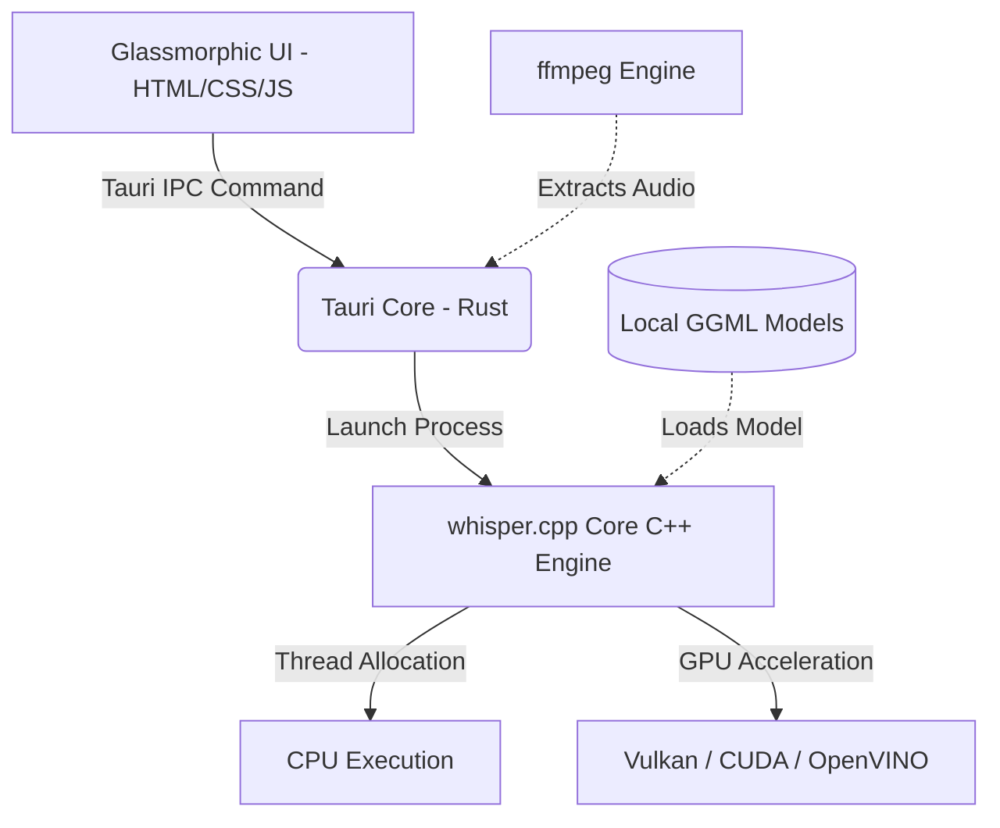

<p align="center">
  
</p>

<h1 align="center">Whisper Desktop</h1>

<p align="center">
  <strong>A premium, state-of-the-art, and gorgeous native Rust & Tauri GUI designed for whisper.cpp.</strong><br>
  Run high-performance local speech-to-text models with ease, beauty, and complete privacy.
</p>

<p align="center">
  <a href="LICENSE"></a>
  
  
</p>

---

## 📸 Screenshots & Visual Walkthrough

Here is a preview of the premium obsidian glassmorphic interface:

| 🎛️ Dashboard Home | 🏗️ Build Screen |
| :---: | :---: |
|  |  |

| 🛠️ Configuration Step | 🎙️ Transcription Screen |
| :---: | :---: |
|  |  |

---

## ✨ Features at a Glance

Whisper Desktop is designed to feel like a next-generation utility, combining the blistering performance of Rust/C++ with a highly aesthetic, responsive, and modern glassmorphic web dashboard.

*   **⚡ Multiple Acceleration Backends:** Choose between **CPU**, **Vulkan**, **OpenVINO**, or **CUDA** directly from the UI. *Note: Compiling the OpenVINO backend requires the OpenVINO package/SDK to be installed on your operating system.*
*   **📥 Integrated Model Downloader:** Easily browse and download GGML models directly from the UI with real-time download speed, progress indicators, and remaining time (ETA) tracking.
*   **📂 Batch Processing Queue:** Import multiple files, view their duration, remove individual files, clear the queue, and transcribe them sequentially with detailed progress.
*   **🎞️ Integrated Media Converter:** Automatically extract audio from video files and convert them to the target 16kHz mono WAV format using integrated FFmpeg utilities.
*   **🎨 Premium Glassmorphic Design:** A modern dark-mode interface featuring elegant micro-animations, royal-blue gradient glowing accents, and fluid layout transitions.
*   **📦 Easy Drag & Drop HUD:** Drag audio or video files anywhere into the application to instantly load them into your queue.
*   **📊 Live Telemetry HUD:** Real-time hardware performance monitoring tracking CPU usage, RAM utilization, and active GPU metrics during transcription.
*   **⚙️ Full Transcription Settings:** Adjust transcription parameters such as GGML model selection, thread count, target language, translation to English, and output formats (TXT, SRT, VTT).
*   **★ Spec-Guided Recommendations:** Automatically recommends optimal model sizes and quantization formats (e.g. 5-bit/8-bit) based on detected system hardware and GPU acceleration.

---

## 🛠️ Interactive Architecture

Whisper Desktop orchestrates native `whisper.cpp` binaries using Tauri’s lightning-fast Rust IPC bridge. 



---

## 🚀 Installation & Packaging

### 📦 Arch Linux (AUR)
Whisper Desktop is available in the Arch User Repository (AUR) as a precompiled binary package (recommended for Arch users):
```bash
paru -S whisper-desktop-bin
```

### 🐧 Debian / Ubuntu (`.deb`)
Download the latest `.deb` file from the [GitHub Releases](https://github.com/AtomicError/whisper-desktop/releases) page and install it:
```bash
sudo dpkg -i Whisper.Desktop_*_amd64.deb
sudo apt-get install -f # Install dependencies if missing
```

### 🎩 RedHat / Fedora (`.rpm`)
Download the `.rpm` package and install via `dnf`:
```bash
sudo dnf install Whisper.Desktop-*.rpm
```

### 🐳 AppImage
For any other Linux distribution, simply download the portable `AppImage`, make it executable, and run it:
```bash
chmod +x Whisper.Desktop_*.AppImage
./Whisper.Desktop_*.AppImage
```

---

## 💻 Development & Building from Source

To build Whisper Desktop locally, ensure you have the following prerequisites installed on your system:
*   **Node.js** (v18 or higher) & **npm**
*   **Rust** toolchain (Cargo, rustc)
*   **System Libraries:** `gtk3`, `webkit2gtk-4.1`, `ffmpeg` (Note: OpenVINO must be installed on your system if compiling the OpenVINO backend)

### 1. Clone the Repository
```bash
git clone https://github.com/ggml-org/whisper.cpp.git
cd whisper.cpp/manager/desktop
```

### 2. Install Frontend Dependencies
```bash
npm install
```

### 3. Run in Development Mode
Start the live-reloading hot development server:
```bash
npm run tauri dev
```

### 4. Build Production Packages
Compile and bundle the production release for your system:
```bash
npm run tauri build
```
Production packages will be generated inside `src-tauri/target/release/bundle/`.

---

## 📦 Project Structure

```
whisper-desktop/
├── src/                      # Glassmorphic Frontend Core
│   ├── assets/               # Custom SVGs, icons, and visual elements
│   ├── index.html            # Main dashboard layout (6 feature panels)
│   ├── styles.css            # Glassmorphism, animations, and color design system
│   └── main.js               # IPC binding, queue state, and UI logic
├── src-tauri/                # Tauri backend (Rust)
│   ├── src/                  # Tauri Rust backend source
│   │   ├── main.rs           # Tauri command bindings, state, and entry point
│   │   ├── builder.rs        # Compilation coordinator for whisper.cpp backends
│   │   └── specs.rs          # Hardware specification detection
│   ├── icons/                # Beautiful high-resolution custom app icons
│   ├── permissions/          # Tauri v2 security policies and capability schemas
│   ├── Cargo.toml            # Rust manifest
│   └── tauri.conf.json       # Build target configs (deb, rpm, appimage)
└── README.md                 # Project documentation
```

---

## 🔒 Privacy & Local Processing

All audio transcription, processing, and recording are executed **100% locally** on your computer. Your audio files, recordings, and transcriptions are never sent to external servers or cloud APIs, ensuring absolute confidentiality and privacy.

---

## 📄 License
This project is licensed under the [MIT License](LICENSE).
