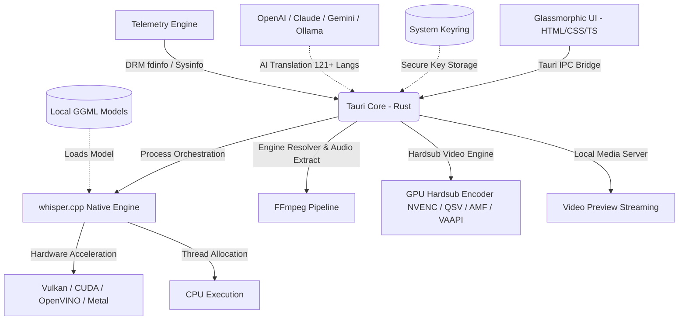

<p align="center">
  
</p>

<h1 align="center">Whisper Desktop</h1>

<p align="center">
  <strong>A premium, high-performance native desktop GUI for local speech-to-text, subtitle styling, and video hardsubbing powered by Whisper.cpp, FFmpeg, and Rust.</strong>
</p>

<p align="center">
  <a href="LICENSE"></a>
  
  
  
</p>

---

## 💡 What is Whisper Desktop?

**Whisper Desktop** is a modern, lightweight, and privacy-focused desktop application designed to bring the power of native **whisper.cpp** speech recognition directly to your personal computer—now featuring a dedicated **Studio Hardsub** video burn-in engine.

Running AI models and video processing pipelines locally often requires complex CLI scripts, extensive Python environments, or exposing sensitive media to paid cloud providers. **Whisper Desktop** eliminates those friction points by pairing a blazing-fast **Rust & Tauri** core with native `whisper.cpp` binaries, static/system `FFmpeg` engines, and an elegant glassmorphic GUI.

### 🎯 Core Goals & Key Highlights

* **🔒 100% Local & Private:** Speech recognition, audio processing, and video hardsubbing run entirely on your local machine. No data is sent to external servers unless you opt into AI translation.
* **⚡ Multi-Backend Hardware Acceleration:** Seamlessly switch between **CPU**, **Vulkan**, **CUDA**, **OpenVINO**, or **Metal/CoreML** directly from the interface for near-instant transcription.
* **🎬 Studio Hardsub 2.0 & Video Burn-in:** Burn styled subtitles directly into videos with full GPU acceleration (NVENC, Intel QSV / Xe KMD, AMD AMF, Apple VideoToolbox, VAAPI), offline bundled fonts, and real-time sub-pixel Canvas preview.
* **🎞️ Direct Smart Media Processing:** Drop any video or audio file directly into the app—no manual pre-conversion or audio extraction required.
* **🤖 Multi-Provider AI Translation:** Post-process and translate subtitles into 121+ languages using OpenAI, Anthropic (Claude), Google Gemini, DeepSeek, or local LLMs (Ollama/LM Studio) with secure OS keychain storage.
* **📊 Sidebar Real-Time Telemetry HUD:** Live hardware monitoring (CPU, RAM, VRAM, and GPU utilization via Linux DRM `fdinfo` with `nvtop` parity, Intel Xe KMD, AMD, and NVIDIA).
* **📦 Universal Cross-Platform Support:** Ready-to-use binaries and packages for **Linux** (AppImage x86_64/ARM64, Deb, Rpm, AUR), **Windows** (x86_64, ARM64 / Windows on ARM), and **macOS** (Apple Silicon & Intel Universal).

---

## 📸 Screenshots & Visual Walkthrough

<div align="center">
  
  
  <br/><br/>
  
  
</div>

---

## ✨ Features Breakdown

### 🎙️ Speech-to-Text Engine & Audio Pipeline
* **Multi-Acceleration Backends:** Choose between **CPU**, **Vulkan**, **OpenVINO**, or **CUDA** directly from the UI. Precompiled binaries are bundled—no local AI toolchain or SDK setup required.
* **Direct Smart Media Processing:** Drop any video or audio format (`MP4`, `MKV`, `AVI`, `MOV`, `FLV`, `WEBM`, `MP3`, `WAV`, `FLAC`, `M4A`, `AAC`, `OGG`, `OPUS`, etc.)—the built-in FFmpeg pipeline transparently extracts and normalizes media into a 16kHz mono WAV stream on the fly. Smart path redirection automatically routes outputs to `~/Documents/WhisperOutputs/` when working outside your home folder.
* **Native Rust Streaming Downloader:** Browse, download, pause, resume, and manage GGML models (Tiny, Base, Small, Medium, Large-v1/v2/v3, Q4/Q5/Q8) with live speed, byte progress, and ETA calculation powered by a native streaming pipeline.
* **Batch Processing Queue:** Import multiple media files via Drag & Drop, reorder queue items, inspect duration metadata, and transcribe sequentially with automatic background processing.
* **Granular Decoding Controls:** Fine-tune threads, processors, temperature fallback, beam size, best-of, initial prompts, carry-over prompts, diarization, and word-level timestamps (DTW).
* **Silero VAD Silence Filtering:** Configure VAD threshold, minimum speech duration, minimum silence duration, speech padding, and segment overlap.
* **Flexible Export Formats:** Export transcripts as **SRT, VTT, LRC, TXT, CSV, JSON**, and word-level timestamp files.
* **Hardware-Guided Recommendations:** Recommends optimal model sizes and quantization formats based on detected RAM, CPU cores, and GPU hardware.

---

### 🎬 Studio Hardsub 2.0 & Video Subtitle Styler
* **GPU-Accelerated Hardsubbing:** Burn subtitles directly into video frames utilizing hardware encoders:
  * **NVIDIA:** `h264_nvenc`, `hevc_nvenc`, `av1_nvenc`
  * **Intel:** `h264_qsv`, `hevc_qsv`, `av1_qsv` (with Linux Intel Xe KMD & i915 support)
  * **AMD:** `h264_amf`, `hevc_amf`, `av1_amf`
  * **Apple:** `h264_videotoolbox`, `hevc_videotoolbox`
  * **Linux VAAPI & Software:** `h264_vaapi`, `hevc_vaapi`, `libx264`, `libx265`
* **Real Video Frame Preview:** Seamless local media server providing instant frame preview and freeze-frame seeking without file permission or sandbox restrictions.
* **Canvas-Based Subtitle Renderer:** Sub-pixel preview renderer accurately matching `libass` output—including rounded-corner background boxes, text baselines, dynamic font scaling, outline strokes, and video rotation handling.
* **RTL & Persian/Arabic Typography:** Native Right-to-Left (RTL) layout support with correct punctuation placement for Persian, Arabic, and Hebrew subtitles.
* **Offline Bundled Fonts:** Embedded typography packages (including *Inter*, *Vazirmatn*, *JetBrains Mono*, *Roboto*, etc.) ensuring identical rendering across different operating systems.
* **Dual-Pane Studio Layout:** Collapsible wizard accordion, smart dropzones, block subtitle editor, and synchronized cue cards.
* **Configurable FFmpeg Engine:** Select between bundled static FFmpeg binaries or system-installed FFmpeg with automatic capability detection and fallback.

---

### 🤖 AI Subtitle Translation Pipeline
* **Multi-Provider API Manager:** Connect to **OpenAI**, **Anthropic (Claude)**, **Google Gemini**, **DeepSeek**, or **OpenAI-Compatible** endpoints (e.g., LM Studio, Ollama, vLLM).
* **121+ Languages Supported:** Translate and localize subtitles across a comprehensive matrix of world languages.
* **🔐 Secure System Keyring:** Store API keys safely in your native OS keychain (`Secret Service` / `KWallet` / `Windows Credential Manager` / `macOS Keychain`) instead of plain text configuration files.
* **Context-Aware Timestamp Preservation:** Token-aware chunking with overlap keeps SRT/VTT/LRC subtitle indices and millisecond timestamps aligned.
* **Adaptive Error Recovery:** Automatic token-limit detection dynamically splits chunks and retries failed segments without halting the batch.

---

### 📊 Sidebar Hardware Telemetry, UX & Logs
* **Live Transcript Viewer:** Real-time line streaming with active word highlighting, search/filter capabilities, and inline editing.
* **Linux DRM `fdinfo` Engine Utilization:** High-fidelity GPU engine monitoring on Linux with `nvtop` parity for Intel, AMD, and NVIDIA hardware.
* **Non-Blocking Telemetry Worker:** Hardware statistics polling (CPU load, RAM consumption, GPU VRAM) offloaded to dedicated background threads to prevent UI stutter.
* **Unified Activity Logs:** Centralized log panel with category filtering (FFmpeg, Whisper, AI Translation, Build, System) and export options.
* **Native OS Desktop Notifications:** System-level alerts when long-running transcription or hardsub export tasks finish.
* **Clipboard Manager Integration:** Native clipboard integration with multi-tier fallback for instant transcript copying.

---

## 🛠️ System Architecture



---

## 🚀 Installation & Packaging

### 🐧 Linux (x86_64 & ARM64)
Download either the lightweight **Universal** package (`CPU` + `Vulkan` + `OpenVINO`) or the dedicated **NVIDIA CUDA** edition from the [Releases](https://github.com/AtomicError/whisper-desktop/releases) page:

#### Debian / Ubuntu (`.deb`)
```bash
# Universal (AMD / Intel / Standard GPU)
sudo apt install ./WhisperDesktop_*_amd64.deb

# NVIDIA CUDA Edition
sudo apt install ./WhisperDesktop_*_amd64-cuda.deb
```

#### RedHat / Fedora (`.rpm`)
```bash
# Universal
sudo dnf install ./WhisperDesktop-*-1.x86_64.rpm

# NVIDIA CUDA Edition
sudo dnf install ./WhisperDesktop-*-1.x86_64-cuda.rpm
```

#### Portable AppImage (x86_64 & ARM64)
```bash
chmod +x WhisperDesktop_*.AppImage
./WhisperDesktop_*.AppImage
```

---

### 🪟 Windows (x86_64 & ARM64)
Choose your preferred installer from the [Releases](https://github.com/AtomicError/whisper-desktop/releases) page:
* **Universal Edition (`x64-setup.exe` / `.msi`):** Includes Standard CPU + Vulkan + Intel OpenVINO. Recommended for AMD, Intel CPU/GPU/Arc, and standard PCs.
* **NVIDIA CUDA Edition (`x64-cuda-setup.exe` / `.msi`):** Dedicated CUDA & cuBLAS hardware acceleration for NVIDIA GPUs.
* Compatible with Windows 10/11 and Windows 11 ARM64 (Snapdragon X Elite / Surface) via Prism.

---

### 🍏 macOS (Apple Silicon & Intel)
Download the Universal `.dmg` from the [Releases](https://github.com/AtomicError/whisper-desktop/releases) page, open the disk image, and drag **Whisper Desktop** into your `Applications` folder. Features native Apple Silicon Metal GPU acceleration and Intel support.

---

## 💻 Building from Source

### Prerequisites
* **Node.js** (v18+) & **npm**
* **Rust** toolchain (latest stable)
* **System Libraries (Linux):** `gtk3`, `webkit2gtk-4.1`, `ffmpeg`

### 1. Clone Repository
```bash
git clone https://github.com/AtomicError/whisper-desktop.git
cd whisper-desktop
```

### 2. Install Dependencies
```bash
npm install
```

### 3. Run Development Mode
```bash
npm run tauri dev
```

### 4. Build Production Bundle
```bash
npm run tauri build
```
Production packages will be generated in `src-tauri/target/release/bundle/`.

---

## 📦 Project Structure

```
whisper-desktop/
├── src/                          # Frontend UI & Studio Logic
│   ├── index.html                # Main UI layout & studio views
│   ├── styles.css                # Glassmorphic design system & UI tokens
│   ├── main.js                   # Application state & IPC bridge
│   ├── hardsub.ts                # Studio Hardsub 2.0 Canvas engine & controller
│   └── fonts/                    # Bundled offline fonts (Inter, Vazirmatn, etc.)
├── src-tauri/                    # Tauri / Rust Backend
│   ├── src/
│   │   ├── main.rs               # App entrypoint & Tauri command handlers
│   │   ├── hardsub.rs            # GPU-accelerated video hardsubbing pipeline
│   │   ├── video_server.rs       # Local HTTP video streaming server
│   │   ├── ffmpeg_resolver.rs    # Static vs. System FFmpeg detection & fallback
│   │   ├── transcribe.rs         # FFmpeg audio extract & whisper-cli orchestration
│   │   ├── downloader.rs         # Native Rust HTTP streaming model downloader
│   │   ├── settings.rs           # Flat atomic settings persistence & auto-migration
│   │   ├── hardware.rs           # DRM fdinfo GPU metrics & sysinfo telemetry
│   │   ├── logger.rs             # In-memory ring buffer logging
│   │   ├── builder.rs            # Build pipeline & environment validation
│   │   └── translation/          # AI Subtitle Translation engine (121+ languages)
│   ├── resources/                # Precompiled binaries (whisper-cli & static ffmpeg)
│   └── tauri.conf.json           # Tauri bundle & cross-platform configuration
└── README.md
```

---

## 🔒 Privacy Guarantee

All speech transcription, audio processing, model downloads, and video hardsubbing run **100% locally** on your computer. Your media files and transcripts never leave your device unless you explicitly enable the optional AI Translation feature with your own API credentials.

---

## 💖 Support the Project

If you find **Whisper Desktop** helpful and want to support its ongoing development, maintenance, and new features, donations are greatly appreciated:

* **TRON (TRX / TRC20):**
  ```text
  TDXH4vErrWunXfd6nHJX5mTNr4uHuPD1im
  ```

---

## 📬 Contact & Community

Have a question, feedback, or want to collaborate? Feel free to reach out:

* **Telegram:** [@TheMrAhmad](https://t.me/TheMrAhmad)

---

## 📄 License
This project is licensed under the [MIT License](LICENSE).

